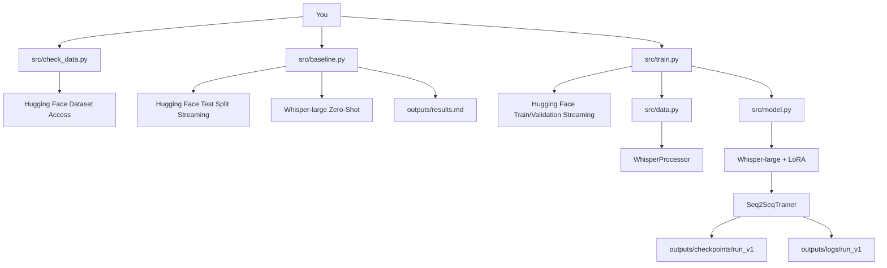
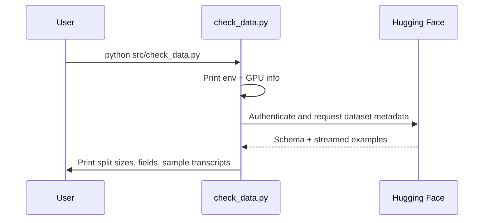
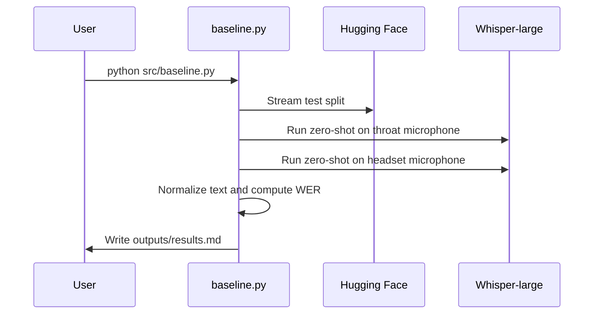
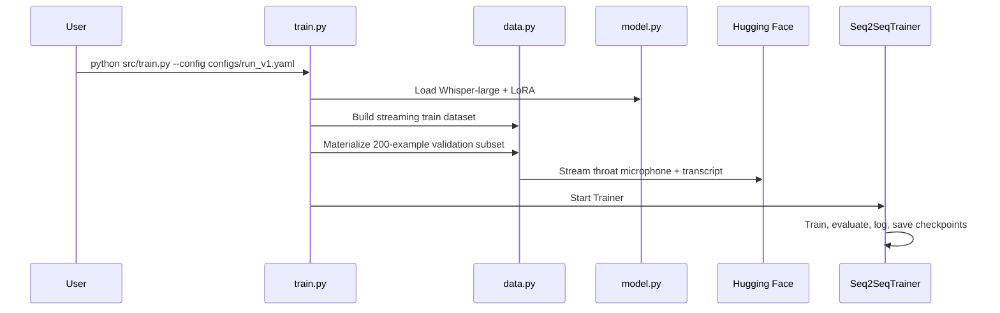
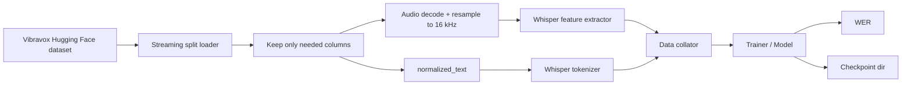

# Fresh Start Guide: Code, Concepts, and RunPod Strategy

This guide is a reset document for the `vibravox-finetune` subproject. It explains:

1. how the current codebase works
2. the fine-tuning concepts behind the code
3. the most cost-conscious way to run it on RunPod

It is based on the current code in this repo and current official RunPod documentation.

# Codebase Walkthrough

## 1. What this project is

This project is a Python training pipeline for adapting `openai/whisper-large` to French throat-microphone speech from the Vibravox dataset.

In plain English:

- the input is body-conducted speech from `audio.throat_microphone`
- the output is French text from `normalized_text`
- the model is Whisper-large
- the adaptation method is LoRA
- the evaluation metric is WER

Application type:

- ML experimentation and training repo

Main purpose:

- measure zero-shot Whisper performance on throat-mic speech
- fine-tune Whisper-large with LoRA on the throat channel
- compare the result against the zero-shot baseline

Primary runtime:

- Python 3.12
- Linux
- CUDA GPU
- Hugging Face ecosystem

Major libraries:

- `transformers`
- `datasets`
- `peft`
- `accelerate`
- `jiwer`
- `torch`

## 2. How to run it

Current commands in the repo:

```bash
python src/check_data.py
python src/baseline.py
python src/train.py --config configs/run_v1.yaml
python src/evaluate.py --checkpoint outputs/checkpoints/best
```

Real status:

- `src/check_data.py` exists and is usable
- `src/baseline.py` exists and was successfully run
- `src/train.py` exists and has been partially debugged
- `src/evaluate.py` is still planned, not yet present

Useful setup commands:

```bash
python3.12 -m venv .venv
source .venv/bin/activate
pip install -r requirements.txt
huggingface-cli login
```

Useful RunPod command pattern:

```bash
tmux new -s train_v1
python src/train.py --config configs/run_v1.yaml | tee outputs/logs/train_v1.log
```

## 3. Repository map

```text
vibravox-finetune/
├── PROJECT_BRIEF.md
├── TECHNICAL_DISCUSSIONS.md
├── ENV_AND_RUN.md
├── requirements.txt
├── codebase-cartographer-SKILL.md
├── configs/
│   └── run_v1.yaml
├── docs/
│   ├── RUNPOD_SETUP.md
│   └── START_FRESH_GUIDE.md
├── outputs/
│   ├── checkpoints/
│   ├── logs/
│   └── results.md
└── src/
    ├── check_data.py
    ├── baseline.py
    ├── data.py
    ├── model.py
    └── train.py
```

Why each important piece matters:

- `PROJECT_BRIEF.md`
  - defines the product-level goal

- `TECHNICAL_DISCUSSIONS.md`
  - contains the locked v1 decisions
  - this is the design contract for model choice, LoRA settings, evaluation style, and precision

- `requirements.txt`
  - controls environment reproducibility

- `configs/run_v1.yaml`
  - controls runtime behavior without editing Python code

- `src/check_data.py`
  - schema discovery and access sanity check

- `src/baseline.py`
  - zero-shot baseline measurement

- `src/data.py`
  - dataset streaming, preprocessing, and collation

- `src/model.py`
  - Whisper-large + LoRA construction

- `src/train.py`
  - training entry point

- `outputs/results.md`
  - current baseline record

## 4. Architecture overview



Simple explanation:

- Stage 1 checks environment and schema
- Stage 2 measures baseline WER
- Stage 3 streams training data, builds Whisper features on the fly, and trains a LoRA-adapted Whisper-large model
- outputs are written to logs, checkpoints, and results files

## 5. Main execution flow

### Stage 1 flow



### Stage 2 flow



### Stage 3 flow



## 6. Key concepts explained simply

### Concept: Whisper feature extraction

Where:

- `src/data.py`
- `src/baseline.py`

Meaning:

The code does not feed raw audio directly into the Transformer. It first converts the waveform into log-mel features that Whisper expects.

Why it exists:

- Whisper was trained that way
- using the wrong representation would break the model

Analogy:

- think of it as converting raw sound into a spectrogram image that the model knows how to read

Common confusion:

- “Whisper is audio-to-text directly” is true at the task level, but internally the audio is transformed before the Transformer sees it

### Concept: LoRA

Where:

- `src/model.py`

Meaning:

LoRA adds small trainable low-rank adapter weights into selected attention projections instead of updating the whole model.

Why it exists:

- full Whisper-large training is expensive
- LoRA reduces memory and compute cost

Analogy:

- instead of rebuilding the whole engine, you bolt on a small tuning kit

Common confusion:

- LoRA does not replace the base model
- it changes a small subset of trainable behavior on top of the frozen base

### Concept: Streaming dataset loading

Where:

- `src/check_data.py`
- `src/baseline.py`
- `src/data.py`

Meaning:

The repo tries to read examples lazily instead of caching the entire dataset locally.

Why it exists:

- the dataset is large
- naive caching burned both disk and money

Analogy:

- instead of downloading the whole library, you borrow one book page-by-page as needed

Common confusion:

- streaming reduces disk usage
- it does not eliminate network dependency

### Concept: Gradient accumulation

Where:

- `configs/run_v1.yaml`
- `src/train.py`

Meaning:

The model processes one example at a time, but waits 16 steps before applying one optimizer update.

Why it exists:

- effective batch size becomes 16
- memory usage stays low

Analogy:

- instead of making a decision after every single vote, you collect 16 votes and then act

### Concept: Gradient checkpointing

Where:

- `src/model.py`
- `src/train.py`

Meaning:

Intermediate activations are recomputed during backward pass instead of fully stored.

Why it exists:

- saves VRAM

Analogy:

- you throw away scratch work and recalculate it later to save desk space

Common confusion:

- checkpointing saves memory, not money directly
- it often makes runtime slower

## 7. Important files, classes, and functions

### `src/check_data.py`

Purpose:

- cheap environment and schema verification

Important symbols:

- `print_environment_info`
  - prints Python/GPU/runtime facts

- `authenticate_hugging_face`
  - finds cached login or token

- `load_vibravox_dataset`
  - loads dataset in streaming mode

- `print_example_report`
  - inspects schema and prints sample examples

Connections:

- called by: user directly
- calls into: Hugging Face Datasets and Hub
- depends on: dataset access and token availability

### `src/baseline.py`

Purpose:

- compute zero-shot floor and ceiling

Important symbols:

- `load_test_split`
  - streams the test split

- `load_model_and_processor`
  - loads Whisper-large for inference

- `run_channel_baseline`
  - loops through one audio channel and computes WER

- `write_results`
  - writes final numbers to `outputs/results.md`

Connections:

- called by: user directly
- calls into: Whisper-large and Hugging Face streaming dataset
- depends on: GPU, HF access, WER normalization

### `src/data.py`

Purpose:

- owns dataset preprocessing for training

Important symbols:

- `load_streaming_split`
  - loads one split in streaming mode and removes unused columns

- `preprocess_example`
  - converts raw example into Whisper-ready tensors

- `StreamingTrainDataset`
  - endless iterable training stream

- `build_validation_subset`
  - creates the bounded eval set

- `WhisperDataCollator`
  - pads inputs and labels

Connections:

- called by: `src/train.py`
- calls into: Hugging Face Datasets, Whisper feature extractor and tokenizer

### `src/model.py`

Purpose:

- builds model and processor

Important symbols:

- `load_processor`
  - loads `WhisperProcessor`

- `build_lora_config`
  - central LoRA configuration

- `load_model`
  - loads Whisper-large, applies LoRA, enables input grads for checkpointing

Connections:

- called by: `src/train.py`
- calls into: `transformers`, `peft`

### `src/train.py`

Purpose:

- training orchestration

Important symbols:

- `parse_args`
  - reads YAML config path

- `load_config`
  - loads experiment configuration

- `compute_metrics_factory`
  - computes normalized WER during eval

- `LoggingSeq2SeqTrainer`
  - custom trainer subclass with VRAM logging and eval input casting

- `main`
  - full training flow

Connections:

- called by: user directly
- calls into: `src/data.py`, `src/model.py`, `Seq2SeqTrainer`

### `configs/run_v1.yaml`

Purpose:

- hyperparameter authority for Stage 3

Important settings:

- `max_steps: 5000`
- `gradient_accumulation_steps: 16`
- `bf16: true`
- `fp16: false`
- `eval_steps: 500`
- `save_steps: 500`

## 8. Data flow



What enters the system:

- streamed audio examples
- normalized transcript text

How it is transformed:

- audio becomes 16 kHz decoded waveform
- waveform becomes Whisper input features
- transcript becomes token IDs

What comes out:

- loss values
- generated transcripts during eval
- WER
- checkpoints and logs

## 9. Configuration and environment

Important config files:

- `requirements.txt`
- `configs/run_v1.yaml`
- `TECHNICAL_DISCUSSIONS.md`

Environment assumptions:

- Python 3.12
- Linux
- CUDA GPU
- Hugging Face login

Important runtime settings:

- bf16 enabled
- fp16 disabled
- gradient checkpointing enabled
- streamed dataset access where possible

Potential environment mismatch to remember:

- earlier RunPod sessions downgraded Torch from the base image because `requirements.txt` pinned a lower version
- the repo now pins `torch==2.8.0` and `torchaudio==2.8.0` to match the chosen RunPod image

## 10. Testing strategy

Current reality:

- there is no formal automated test suite yet

Practical test strategy in this repo has been staged execution:

- Stage 1 sanity check
- Stage 2 zero-shot baseline
- Stage 3 training startup and eval boundary debugging

What is under-tested:

- end-to-end completion of Stage 3
- checkpoint save/reload path
- future Stage 4 evaluation path

High-value tests to add later:

- smoke-test mode for baseline and train scripts
- one-batch training step test
- one-batch generation eval test
- checkpoint save/load test

## 11. Debugging guide

Likely failure points:

- Hugging Face gated access
- dataset streaming network failures
- dtype mismatches in bf16 runs
- PEFT + gradient checkpointing interaction
- trainer evaluation generation path
- idle billing from forgotten running pods

Files to inspect first:

- `src/check_data.py`
- `src/baseline.py`
- `src/train.py`
- `configs/run_v1.yaml`

Common errors already seen:

- full parquet download when not intended
- `hf_transfer` missing while `HF_HUB_ENABLE_HF_TRANSFER=1`
- streaming network interruptions
- `element 0 of tensors does not require grad`
- bf16 eval dtype mismatch during generation

Useful debugging commands on RunPod:

```bash
nvidia-smi
df -h /workspace
tmux ls
tail -n 80 outputs/logs/train_v1.log
find outputs/checkpoints/run_v1 -maxdepth 2 -type d | sort
```

## 12. Onboarding path

Recommended learning order:

1. Read `PROJECT_BRIEF.md` and `TECHNICAL_DISCUSSIONS.md`
2. Read `src/check_data.py` and understand the real schema
3. Read `src/baseline.py` and understand how baseline WER is measured
4. Read `src/data.py` and understand streaming preprocessing
5. Read `src/model.py` and understand how LoRA is attached
6. Read `src/train.py` and the YAML config together
7. Only then run an expensive job on RunPod

Small safe change to understand the repo better:

- adjust `logging_steps` or `eval_subset_size` in `configs/run_v1.yaml`

That changes behavior without altering pipeline structure.

## 13. Fine-tuning concepts, clearly

### Whisper is encoder-decoder ASR

- encoder reads audio features
- decoder writes text tokens

This is not a CTC pipeline. It is sequence generation.

### Why `normalized_text` is the target

Because the task is speech-to-text transcription in French, not phoneme prediction.

### Why the baseline gap matters

Current numbers:

- throat: `0.7127`
- headset: `0.0895`

This means the model is strong on clean airborne speech and weak on the throat domain. That is exactly the type of domain mismatch fine-tuning is meant to address.

### Why LoRA is the right v1 choice

Full Whisper-large fine-tuning would be heavier in:

- VRAM
- checkpoint size
- optimizer state
- cost

LoRA gives a cheaper first experiment while still allowing meaningful adaptation.

### Why streaming was introduced

Because the naive dataset-loading path tried to download far too much data and consumed credits without producing useful progress.

Streaming shifts the tradeoff:

- much lower disk pressure
- more network dependence

For your current budget, that is the better tradeoff.

## 14. RunPod research: what is the optimum strategy

## 14.1 Pod vs Serverless

RunPod offers:

- Pods
- Serverless endpoints

For this project, use a Pod.

Reason:

- training is long-running
- stateful
- checkpoint-based
- iterative
- shell-debugged

Serverless is better for:

- inference APIs
- request-driven workloads
- asynchronous job handlers packaged as endpoint functions

It is a poor fit for your current training stage.

## 14.2 Why Serverless is not the optimum choice here

Even though Serverless can avoid idle billing, it adds the wrong complexity:

- packaging training as a handler
- handling worker lifecycle around a stateful training job
- indirect filesystem and storage assumptions
- harder iteration/debugging

The real waste you experienced came from:

- idle running pods
- failed jobs
- expensive first-run debugging

That does not imply Serverless is better. It implies your Pod workflow needs to be disciplined.

## 14.3 Billing facts that matter

Official RunPod docs indicate:

- running Pods are billed for compute even if idle
- stopping a Pod stops compute billing
- storage billing continues
- different storage types have different persistence and pricing behavior

Operational rule:

- if no job is actively running, stop the Pod

## 14.4 Best Pod workflow for this repo

Use this loop:

1. edit code locally
2. push to GitHub
3. pull on RunPod
4. start job inside `tmux`
5. monitor the first few minutes
6. detach
7. stop Pod immediately after job finishes or fails

This is the optimum choice for your current budget.

## 14.5 Storage strategy

### Best default for you now

- live work in `/workspace`
- use Pod-attached persistent storage for active experiments
- back up important artifacts to local or GitHub

### When a network volume helps

Use it if:

- you want data independent of Pod lifecycle
- you want one durable storage layer across multiple Pods
- you want access via RunPod’s S3-compatible API

### When a network volume is not necessary

If you are:

- running one Pod at a time
- keeping code in GitHub
- copying important logs/checkpoints out regularly

then a Pod-local persistent workspace is simpler.

## 14.6 Can you use your local disk and only borrow RunPod GPU

Not in the direct way people often imagine.

Bad idea:

- keep the dataset live on your laptop disk
- have the remote GPU training job depend on that machine continuously

Why it is bad:

- unreliable connection
- poor throughput
- laptop must remain online
- fragile training setup

Practical alternative:

- keep code, notes, and copied outputs locally
- keep the active training filesystem on RunPod
- optionally use portable cloud storage rather than your laptop as the live data source

So the answer is:

- local machine as source of truth for code and copied artifacts: yes
- local machine as live mounted training disk for RunPod GPU: not the recommended strategy

## 14.7 Fresh-start recommendation

If starting fresh to minimize wasted credits:

1. use a Pod, not Serverless
2. use SSH plus `tmux`
3. stop the Pod whenever idle
4. stream datasets whenever possible
5. add cheap smoke-test modes before full expensive runs
6. lower early checkpoint interval during debugging
7. back up outputs after each milestone

## 15. Practical recommendations before spending more credits

Most useful next improvements:

- add a debug config with fewer steps and more frequent saves
- lower checkpoint interval below `500` while stabilizing training
- add resume support explicitly
- add smoke-test flags for expensive scripts

These are more important for cost control than chasing a slightly different GPU choice.

## 16. Bottom line

The modeling direction is sound:

- Whisper-large
- LoRA
- throat microphone
- normalized French text
- WER evaluation

The main challenge is operational efficiency:

- avoid idle Pods
- avoid expensive first-run failures
- checkpoint earlier
- stream instead of full-cache when possible

The optimum strategy is:

- disciplined Pod usage
- not Serverless training
- local/GitHub code management
- remote GPU only when actually running jobs
- careful storage and checkpoint habits

## Sources

Official RunPod docs used for the infrastructure guidance:

- Pods overview: https://docs.runpod.io/pods/overview
- Connect to a Pod: https://docs.runpod.io/pods/connect-to-a-pod
- Pod pricing: https://docs.runpod.io/pods/pricing
- Billing information: https://docs.runpod.io/get-started/billing-information
- Pod storage types: https://docs.runpod.io/pods/storage/types
- Network volumes: https://docs.runpod.io/storage/network-volumes
- RunPod S3-compatible API: https://docs.runpod.io/storage/s3-api
- Serverless overview: https://docs.runpod.io/serverless/overview
- Serverless endpoints overview: https://docs.runpod.io/serverless/endpoints/overview
- Serverless endpoint configurations: https://docs.runpod.io/serverless/references/endpoint-configurations
- Serverless pricing: https://docs.runpod.io/serverless/pricing
- Serverless storage overview: https://docs.runpod.io/serverless/storage/overview
